# Language Learner

**Language Learner** is a high-performance, cross-platform desktop application designed for serious language enthusiasts. Built with Python and PyQt6, it combines real-time translation, local session storage, and automated PDF note generation into a seamless, distraction-free interface. 

**NO ADS. NO SUBSCRIPTIONS. ZERO TRANSLATION LIMITS.**

---

## 🎯 Why Use Language Learner?

1. **The "Google Translate" Problem (Automated Note-Taking):** While standard web translators are great for quick lookups, they completely lack native note-taking capabilities. You are forced into a highly manual workflow: translating a word, copying it, switching to a separate app, formatting the text, and saving it. **Language Learner** eliminates this friction. You simply type and translate. With one click, your entire session is compiled into a cleanly formatted, timestamped PDF, allowing you to effortlessly track your learning progress over time.

2. **The "Paid App" Problem (100% Free & Focused):**
Most automated vocabulary and language learning tools on the market either lock their core features behind expensive monthly paywalls or bombard you with distracting advertisements. Language Learner takes a different approach. It is completely free, runs locally on your machine, and has absolutely zero limits on your daily translations or PDF exports. Your only focus should be on your learning journey.

---

## 🌐 Supported Languages

The application features **Universal Input**. By using the "Auto-Detect" feature, you can type your source sentences in absolutely any language—including Japanese, Chinese, Hindi, and more.

Currently, the application outputs precise translations and contextual data into the following **11 Target Languages**:
* 🇦🇪 Arabic
* 🇦🇿 Azerbaijani
* 🇬🇧 English
* 🇫🇷 French
* 🇩🇪 German
* 🇮🇹 Italian
* 🇮🇷 Persian
* 🇵🇹 Portuguese
* 🇷🇺 Russian
* 🇪🇸 Spanish
* 🇹🇷 Turkish

*(Additional target languages will be continuously added in future releases).*

---

## 🚀 How to Download & Run

You do not need to install Python or know how to code to use this application. Standalone executable files are provided for both Windows and Linux.

**For Windows Users:**
1. Navigate to the official [Releases Page](https://github.com/vasif-asadov1/language-learner/releases).
2. Download the `LanguageLearner-Windows.exe` file.
3. Double-click the downloaded file to launch the application. 
*Note: Because this is an independent open-source application, Windows SmartScreen may temporarily block it. Simply click "More info" and then select "Run anyway" to open the app.*

**For Linux Users:**
1. Navigate to the official [Releases Page](https://github.com/vasif-asadov1/language-learner/releases).
2. Download the Linux binary file.
3. Before running it for the first time, you must grant it executable permissions. You can do this by opening your terminal, navigating to your downloads folder, and using the `chmod +x` command on the file. Alternatively, you can simply right-click the file in your file manager, go to Properties, navigate to the Permissions tab, and check the box that allows executing the file as a program.
4. Double-click the file to launch your learning session.

---

## ✨ Core Features & Interface

### Stylish Light and Dark Themes
Whether you are studying in broad daylight or burning the midnight oil, Language Learner adapts to your environment. Switch instantly between a warm, eye-friendly Light Mode (featuring soft `#F5F3EE` sand tones) and a deep, immersive Dark Mode (featuring `#0F1C34` navy/indigo palettes designed to reduce eye strain).

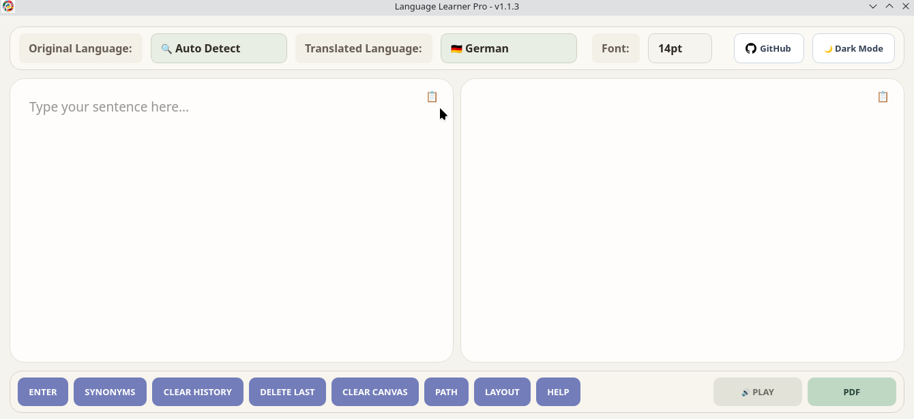
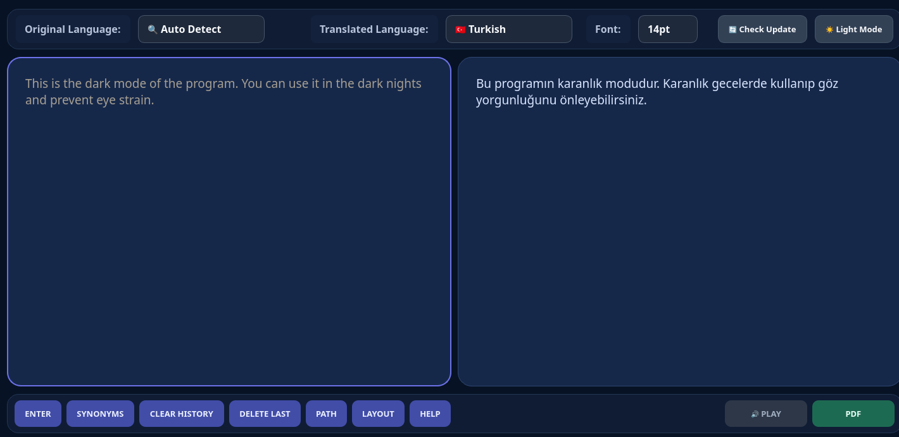

### Scalable Fonts
No more squinting at your screen. Easily scale the application's font size up or down using the top navigation bar to perfectly suit your visual preferences and monitor resolution.

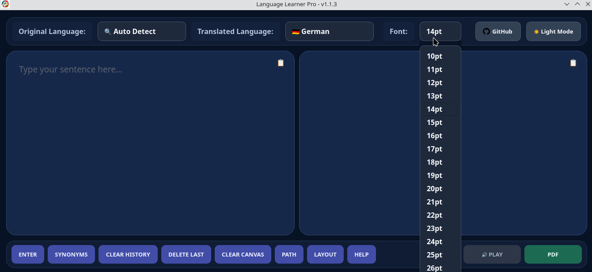

### Smart German Articles
German learners know the struggle of memorizing noun genders. Language Learner features a smart heuristic: when you translate a single noun into German, the app automatically detects the part-of-speech and fetches the correct definitive article (der/die/das) alongside the translation.

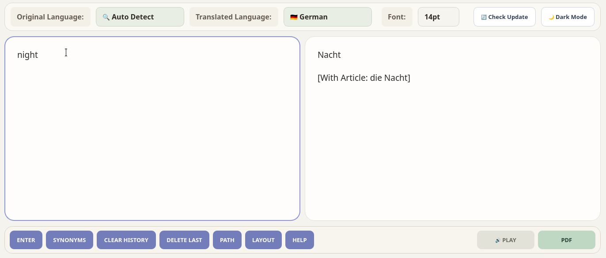

### Contextual Synonyms
Expand your vocabulary on the fly. Enter a single word and click the SYNONYMS button to instantly fetch the top related words, translating all of them simultaneously into your target language.

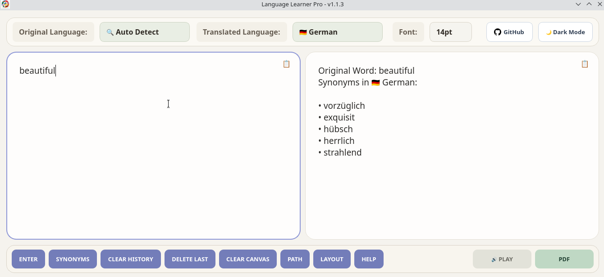

### Configure Your Path
Total control over your data. Click the PATH button to choose exactly which folder on your computer your generated PDF study guides are saved to.

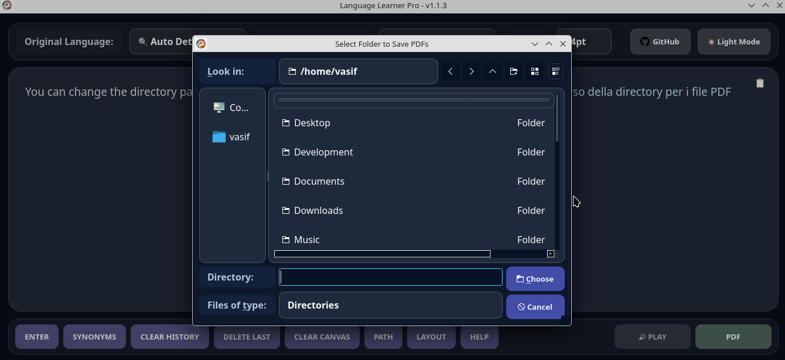

### PDF Layout Options
Customize how your study notes look. Choose between a standard stacked 1-Column layout, or a side-by-side 2-Column layout that places your original text cleanly next to the translation. Once configured, hit the PDF button to instantly generate your document!

| 1-Column Layout Output | 2-Column Layout Output |
| :---: | :---: |
| 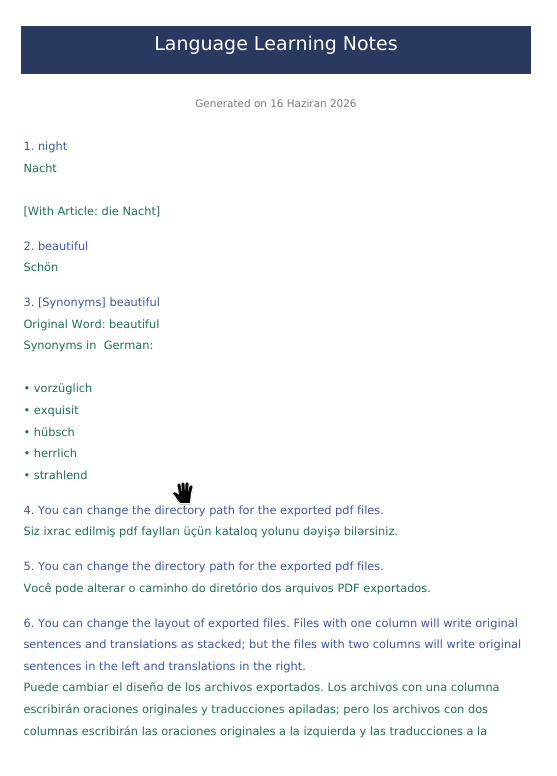 | 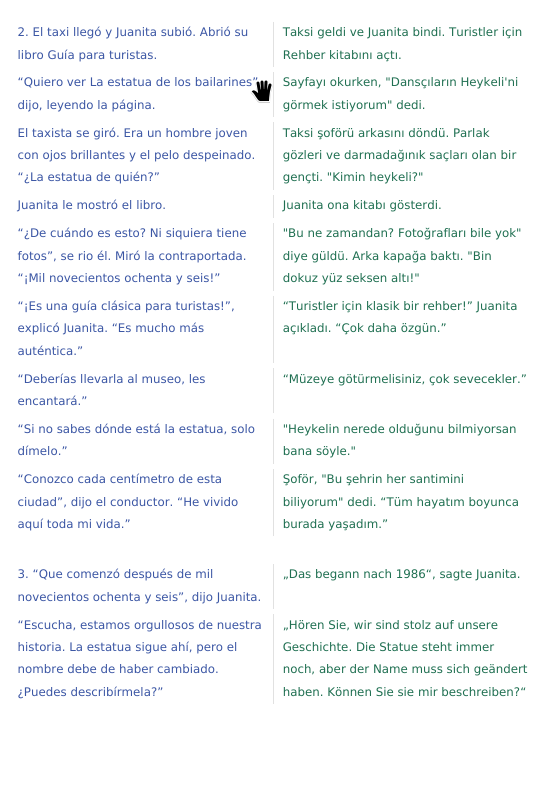 |

### Pronunciation of Non-Latin Alphabets
Learning a language with a new alphabet can be intimidating. When translating into Russian, Arabic, or Persian, a "Show Pronunciation" checkbox dynamically appears. When checked, the app provides precise phonetic transliteration in English characters to help beginners speak immediately.

*Pronunciation Enabled:*
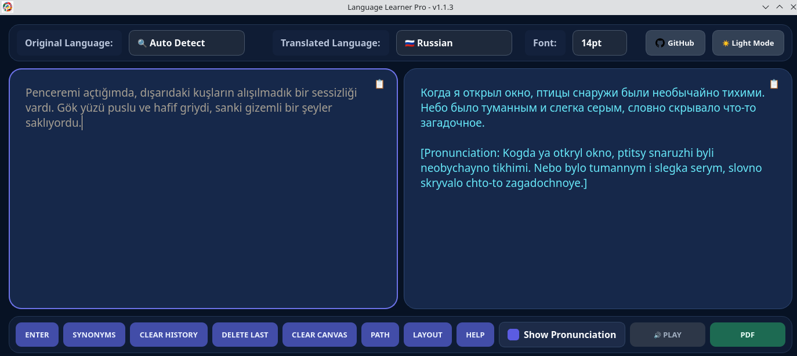

*Pronunciation Disabled:*
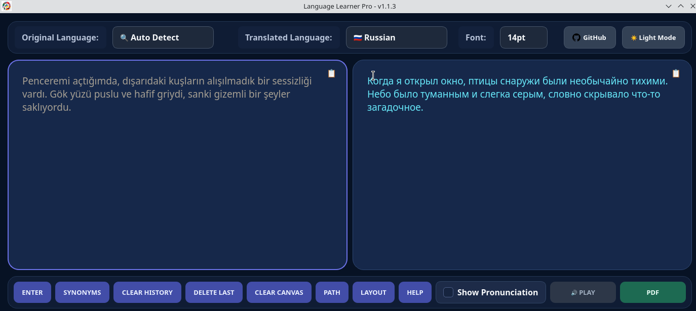

### Immediate Instructions - Helper
Forget reading complex wikis. Everything you need to know about navigating the application, managing your session database, and utilizing keyboard shortcuts is available instantly via the beautifully styled in-app HELP dialog.

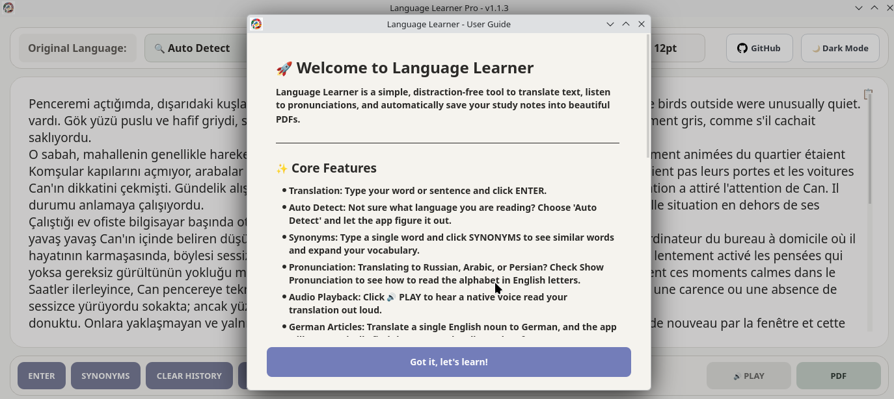

### GitHub Repository Integration
Want to see the source code or report a bug? Use the top navigation bar to seamlessly jump straight to the [official GitHub Repository](https://github.com/vasif-asadov1/language-learner).

---

## ⌨️ Keyboard Shortcuts

Speed is critical for an unbroken learning workflow. The application features global hotkeys so you never have to take your hands off the keyboard:

| Action | Shortcut | Description | 
| ----- | ----- | ----- | 
| **Translate** | `Shift + Enter` | Instantly translates the current text inside the input block. | 
| **New Line** | `Enter` | Drops to a new line inside the input box for typing longer paragraphs. | 
| **Export PDF** | `Ctrl + Shift + E` | Immediately compiles the current session into a saved PDF document. |

---

## 🔒 License & Copyright

**Copyright © 2026 Vasif Asadov. All rights reserved.**

This application is proprietary software. It is provided strictly as **Freeware** for personal, educational, and non-commercial language learning purposes. 

* **Usage:** Anyone is free to download, run, and use the compiled application binaries completely free of charge.
* **Restrictions:** Unauthorized copying, cloning, modification, redistribution, sublicensing, or creating public forks of this source code repository for any purpose is **strictly prohibited** without prior written permission from the copyright holder. 

By downloading or accessing this software, you agree to use it as an end-user only.